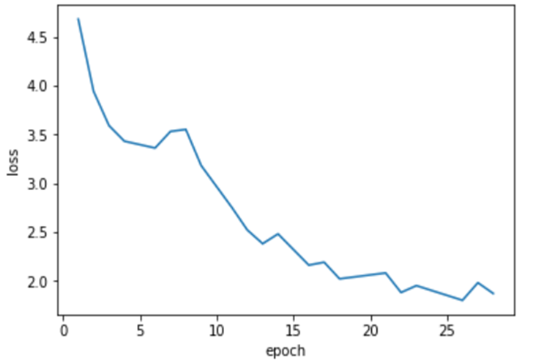

# A transformer-based multilingual (English & Korean) grapheme-to-phoneme (G2P) converter

Created by Jungsun Yoo.
This is an end-to-end neural engine which converts English/Korean sentences into phonemes. 
This code is heavily based on [A TensorFlow Implementation of The Transformer: Attention Is All You Need by Kyubyong](https://github.com/Kyubyong/transformer).

## Requirements
* python==3.x 
* tensorflow==1.12.0
* numpy>=1.15.4
* sentencepiece==0.1.8
* tqdm>=4.28.1

## Datasets

Under the folder 'sentences,' you should have parallel sets of grapheme and phonemes (both Korean and English) divided into train, test, and eval.
File format should be .bpe and encoding should be in unicode-8.
For English phonemes, each word should be wrapped in curly brackets. For Korean phonemes, a space between words is enough.
For example, there should be six bpe files named as: train.grapheme.bpe, train.phoneme.bpe, eval.grapheme.bpe, eval. phoneme.bpe, test.grapheme.bpe, and test.phoneme.bpe.
And an exemplar grapheme.bpe might look like: 

```
it's okay.
포장배송, 송장등록
```

And its corresponding (parallel) phoneme.bpe might look like: 

```
{IH T S} {OW K EY}.
포장배송, 송짱등록
```

## Training
* STEPS. Run the following command.
```
python train.py
```
Check `hparams.py` to see which parameters are possible. For example,
```
python train.py --logdir myLog --batch_size 256 --dropout_rate 0.5
```

## Training Loss Curve



## Inference (=test)
* Run
```
python test.py --ckpt log/1/iwslt2016_E19L2.64-29146 (OR yourCkptFile OR yourCkptFileDirectory)
```

## Results
* Run
```
python test_performance.py --ckpt log/1/iwslt2016_E19L2.64-29146 (OR yourCkptFile OR yourCkptFileDirectory)
```
* All evaluation results are available in [eval/1](eval/1) and [test/1](test/1).
